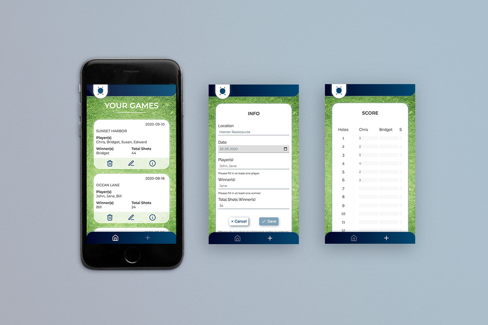

**Capstone project in the course of the web development bootcamp by neuefische**

## Description

### An app for ambitious minigolf players

Par1 offers ambitious minigolf players a place where they can save their games with all important information. Thereby, game details of past games as well as the development steps of the players can be retrieved at any time.

## Main Feature

Users can fill out a form that asks for all important game details such as location and date as well as who has played and won. Additionally, it keeps track of the scores of all players at all 18 holes. These Information are saved and can be retrieved at any time. Furthermore, game entries can be edited and deleted as well.

## Motivation

In the summer, my friends and I are often playing minigolf together - occasionally resulting in a little seasonal competition. But at the end it is very likely that we have lost track of all our games and scores. You could imagine how we discuss with a wink who had won.
With my app, Par1, I would like to provide a space to save all these important game details and scores. Allowing us to have less discussions and more of a nice after game get-together.

## Look & Feel

## Demo

A hosted version can be found here:
[Par1](https://par1.vercel.app/)

## Tech Stack

- React
- React Hooks
- React Router
- Styled Components
- PropTypes
- Styleguidist
- uuid
- React Testing Library
- Jest
- Cypress

## Project setup

1. Clone this repository
2. Install all npm dependencies

   `$ npm install`

3. To run the app in development mode

   `$ npm start`

   Then open http://localhost:3000 to view it in the browser

4. To run Styleguidist

   `$ npm run styleguide`

5. To run unit and component tests

   `$ npm run test`

6. To run Cypress tests

   `$ npm run cypress`

7. Create a build ready for deployment

   `$ npm run build`

## License

MIT © Jana Häusler

---

[neuefische](https://github.com/neuefisch), thank you a lot for this awesome experience, for all your support and for opening up this exciting world!
